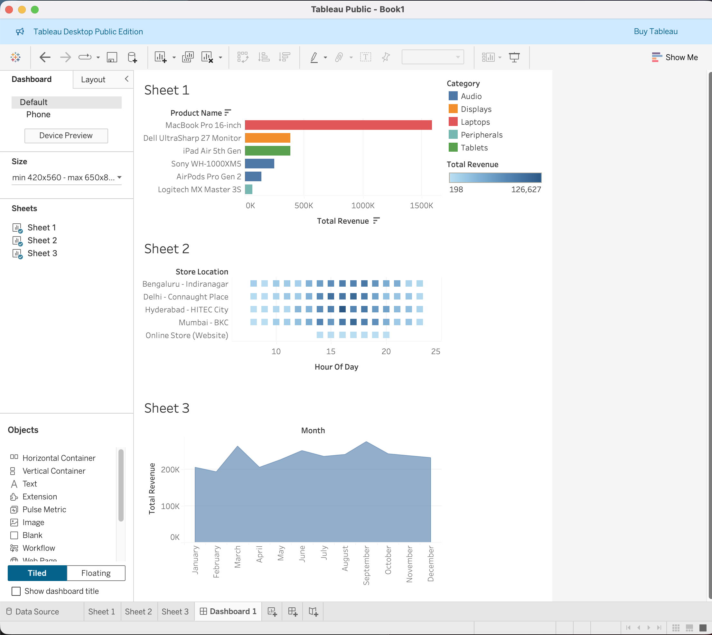

# Omnichannel Retail Sales and Inventory Analytics Dashboard

## Executive Summary
This project delivers an end-to-end data analytics pipeline designed to unify sales data from fragmented physical and digital channels. By processing 3,000+ transaction records, the dashboard identifies seasonal revenue patterns and optimizes inventory turnover for a multi-location retail ecosystem.

## Business Insights & KPIs
1. **High-Value Drivers:** The 'MacBook Pro 16-inch' is the primary revenue driver, contributing significantly to the Laptops category.
2. **Peak Operational Windows:** Heatmap analysis reveals that peak transaction volume occurs between 16:00 and 20:00 across major hubs like Bengaluru and Mumbai, suggesting a need for increased staff during these windows.
3. **Seasonality:** The time-series analysis shows consistent revenue growth, with strategic spikes in Q3 and Q4, providing a foundation for targeted marketing campaigns.

## Technical Architecture
* **Data Engineering:** Python (Pandas/NumPy) for automated cleaning and imputation of missing values.
* **Database Management:** SQL (MySQL) for complex aggregations and geographic revenue distribution.
* **Business Intelligence:** Tableau for interactive, multi-sheet executive dashboards.

## Dashboard Preview

